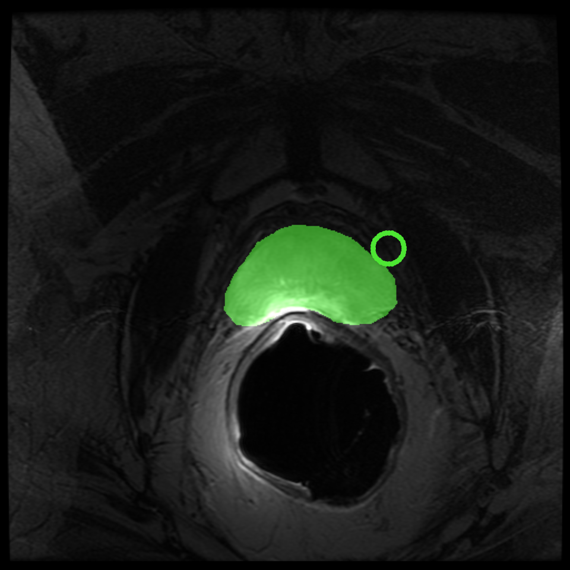

# Port It! — MATLAB → Python

### Same behaviour, new language.

An AI-assisted software migration stand "Port It! matlab2python" for **Vibe Coding in Medical Imaging:
Responsible LLM-Assisted Programming at MICCAI 2026**.

The starting point is [`masker.m`](masker.m): a compact MATLAB tool for viewing
2D or 3D medical images and interactively painting a binary mask. The goal is a
simple, readable, one-file Python version that reproduces its behaviour.

> **Do not improve the tool yet. First reproduce what it actually does.**

## At a glance

1. **Meet the original:** skim [`masker.m`](masker.m) and notice how much interaction fits into one small file.
2. **Ask the agent to port it:** use Prompt 1 below, either in one go or with a pause after its analysis.
3. **Run it on a real scan:** download the prostate MRI and open the generated Python tool.
4. **Take the mouse:** try every control, including held-button drawing and modifier-plus-wheel actions.
5. **Compare and refine:** share what you observed, then use Prompt 2 for a source-to-source audit.
6. **Compare notes:** what did the agent catch, what benefited from a human check, and what changed between languages?

The repository also includes a reference [`masker.py`](masker.py).

## One shot, or pause after analysis?

There is no single right answer. A one-shot run is a fun speed test; pausing after
the agent's behaviour inventory makes its assumptions easier to see before code
appears. For this stand, we suggest the short **analysis-first, then iterate**
route: ask the agent - not the participant - to extract the behaviour, look over
it, then continue. Prompt 1 supports either style.

## Prompt 1 — port it

Open the repository in your coding agent and paste this (the example code is generated by Codex with VSC):

```text
Port the local masker.m into a single-file Python application named masker.py.

This is a behavioural migration, not a redesign. Treat the executable MATLAB
code - not its comments and not what you think the app ought to do - as the source of
truth. Read the whole file before editing and first build a compact behaviour
inventory covering inputs, preprocessing, state, callbacks, boundaries, return
modes, and saving. Then implement from that inventory.

Requirements:
- Use NumPy and Matplotlib. Keep the code simple, readable, self-contained, and
  the GUI minimalist; do not add panels, sliders, or unrelated features.
- Support 2D/3D images and an optional mask. Preserve the exact compatibility
  checks, empty-mask creation, threshold, type conversion, normalisation, initial
  values, increments, limits, modifier priority, and edge behaviour.
- Reproduce every interaction: wheel through slices; left-click/drag to paint;
  right-click/drag to erase; hold s, c, or a while scrolling to change brush
  size, contrast, or mask opacity. Match directions and circular brush geometry.
- Preserve the display calculation, random mask colour, guide, figure lifetime,
  blocking/return modes, and close/save paths.
- Keep dragging responsive: use vectorised operations, reuse artists and state,
  and avoid pixel loops or rebuilding the GUI during motion events.
- Provide a callable Python API and a minimal .npy command-line interface. Make
  unavoidable file-format, coordinate, or API changes explicit.

After implementation, compare masker.py with masker.m callback by callback. Run
syntax and headless tests for non-visual logic, fix unintended differences, and
finish with a short table marking each item as "exact match", "deliberate platform
adaptation", or "still needs human GUI verification". Do not stop merely because
the window opens or the code compiles.
```

## Prompt 2 — compare and refine

After trying the GUI, share anything you noticed and follow with:

```text
Re-read masker.m as the source and perform a forensic parity review.
Map every input rule, state variable, display calculation, callback branch,
bound, return path, and save path to masker.py. Exercise testable callbacks with
synthetic 2D/3D arrays and fix every unintended mismatch without redesigning the
UI. Then give me a five-minute human acceptance script for wheel direction,
boundaries, continuous painting/erasing, modifier-plus-wheel controls, brush
alignment, responsiveness, closing, returning, and saving.
```

## Why this little file is interesting

`masker.m` is small, but it is an event-driven application rather than a simple
numerical function. It combines data validation and normalisation, held-button
painting, key-modified scrolling, bounded state, responsive redraws, and
close/return/save behaviour. That makes it a lovely example of why a successful
port is about understanding behaviour, not only translating syntax.

## Controls to reproduce

| Input | Behaviour |
|---|---|
| Mouse wheel | Move through slices |
| Left-click or left-drag | Paint mask |
| Right-click or right-drag | Erase mask |
| `s` + wheel | Change brush radius |
| `c` + wheel | Change image contrast |
| `a` + wheel | Change mask opacity |

## Things worth checking 

- [ ] 2D/3D inputs, masks, singleton dimensions, and incompatible shapes match MATLAB.
- [ ] Normalisation, thresholding, defaults, increments, bounds, and callback priority match.
- [ ] Slice direction/boundaries and click/continuous-drag painting or erasing work.
- [ ] All modifier-plus-wheel controls and the brush footprint match, including at borders.
- [ ] Display, responsiveness, closing, returning, and saving have been exercised.
- [ ] Python-specific adaptations and remaining human checks are documented.

## A useful surprise from human testing

Automated checks covered the array logic and callback state, yet the first human
pass found something wonderfully ordinary: pressing `s` opened Matplotlib's
**Save Figure** action instead of acting only as Masker's brush-size modifier.
Masker's callback was present, but Matplotlib also reserves `s` as a shortcut.

The fix was to create the figure without Matplotlib's toolbar, which also matches
the original MATLAB GUI. A repeat test confirmed that holding `s` and scrolling
changes brush size, releasing `s` restores slice scrolling, and no save dialog
appears. It is a small example of what a few minutes of curious, hands-on use can
catch after automated checks succeed.

What would convince you that the interaction is equivalent: a paired screen
recording, an observer checklist, exported-mask comparison, latency measurements,
or a combination of these?

## Try it on a real 3D prostate MRI

[`download_sample.py`](download_sample.py) downloads an anonymised prostate MRI
and manual label from the
[SPL/NCIGT dataset on Zenodo](https://doi.org/10.5281/zenodo.16396), verifies the
published checksums, and converts them to `(512, 512, 27)` NumPy arrays:

```bash
python -m pip install numpy matplotlib
python download_sample.py
python masker.py sample_data/prostate_mri.npy \
  --output sample_data/my_mask.npy
```

To edit the supplied prostate contour instead:

```bash
python masker.py sample_data/prostate_mri.npy \
  --mask sample_data/prostate_mask.npy
```



The screenshot is exported from the real Python figure. To capture the original
MATLAB tool on the same voxels, run:

```bash
matlab -batch "capture_matlab_screenshot"
```

This writes `docs/images/masker-matlab.png`; see the reproducible
[`Python`](capture_python_screenshot.py) and
[`MATLAB`](capture_matlab_screenshot.m) capture scripts.

## Using the reference with your own array

```bash
python masker.py image.npy --mask existing-mask.npy --output edited-mask.npy
```

Both options are optional. From Python:

```python
import numpy as np
from masker import masker

edited_mask = masker(np.load("image.npy"))
```

## Source and acknowledgement

The included [`masker.m`](masker.m) is an unmodified copy of Yipeng Hu's
[Masker source](https://github.com/YipengHu/matlab-common-tools/tree/master/Masker),
written at the UCL Centre for Medical Image Computing in August 2017. The
upstream project is MIT-licensed. This repository uses [`LICENSE`](LICENSE).

The sample and screenshots containing it are derived from *Annotated MRI and
ultrasound volume images of the prostate* by Fedorov, Nguyen, Tuncali, and
Tempany, licensed
[CC BY-NC-SA 4.0](https://creativecommons.org/licenses/by-nc-sa/4.0/). They are
not covered by this repository's Apache-2.0 license; see
[`docs/images/README.md`](docs/images/README.md).
